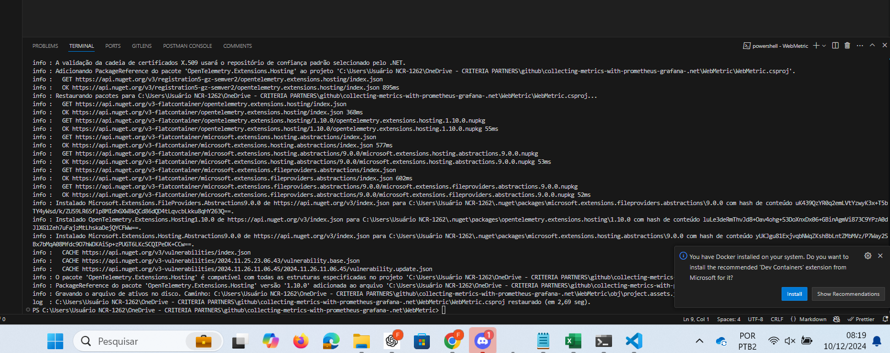
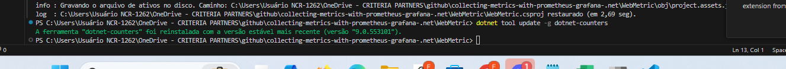
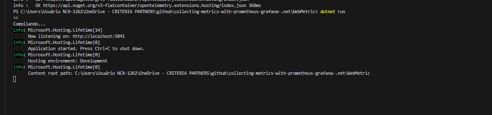
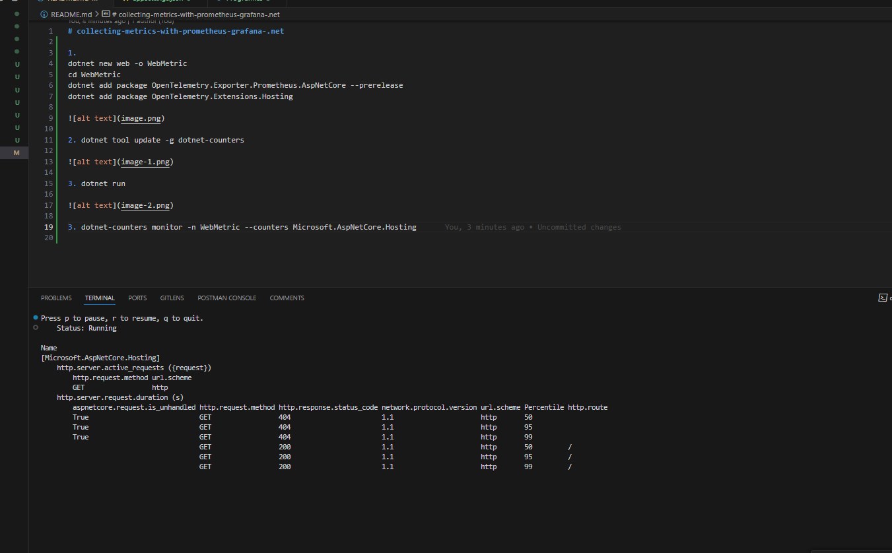
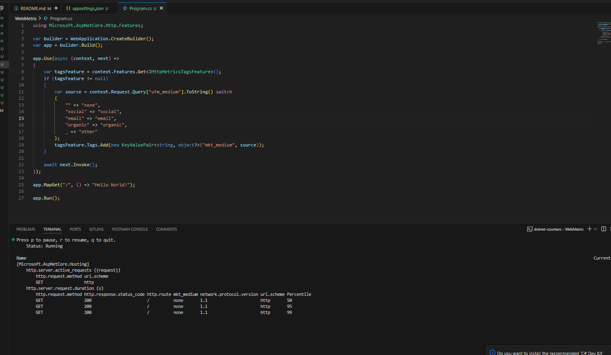
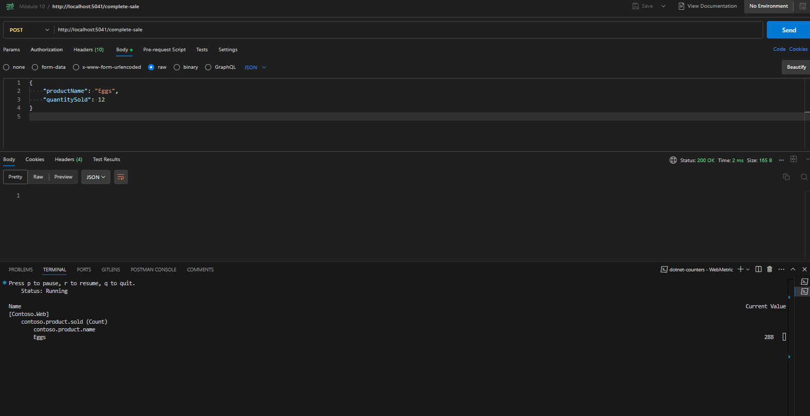

# collecting-metrics-with-prometheus-grafana-.net

1. 
dotnet new web -o WebMetric
cd WebMetric
dotnet add package OpenTelemetry.Exporter.Prometheus.AspNetCore --prerelease
dotnet add package OpenTelemetry.Extensions.Hosting

2. dotnet tool update -g dotnet-counters

3. dotnet run

4. dotnet-counters monitor -n WebMetric --counters Microsoft.AspNetCore.Hosting

5. Métrica  http.server.request.duration

6. dotnet-counters monitor -n WebMetric --counters Contoso.Web

