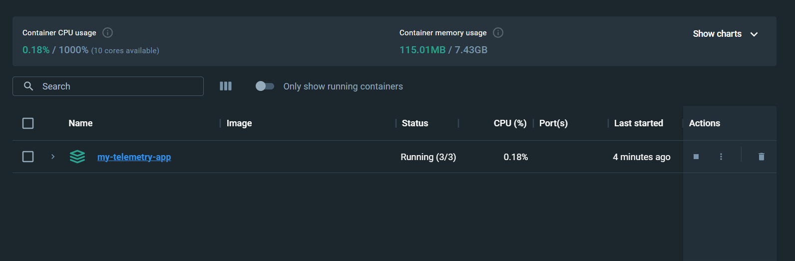
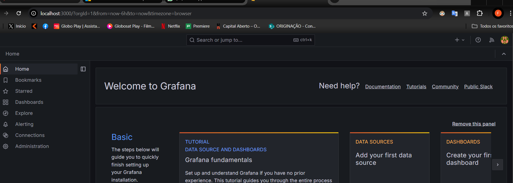
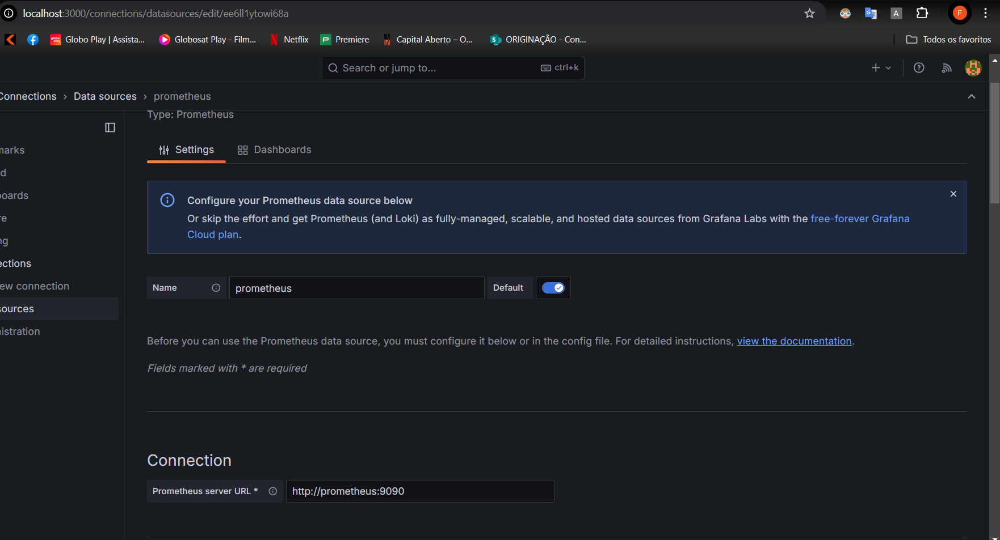
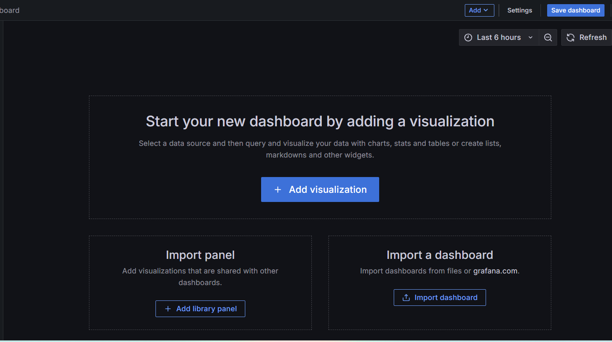
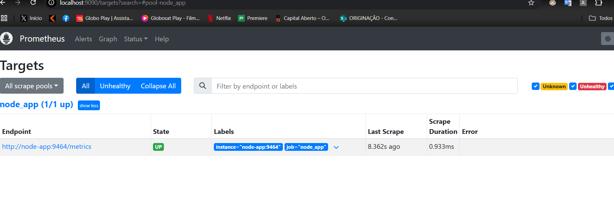
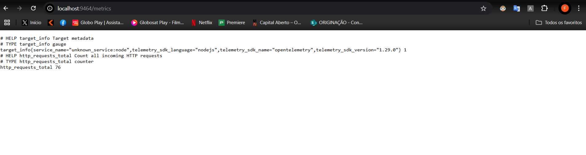
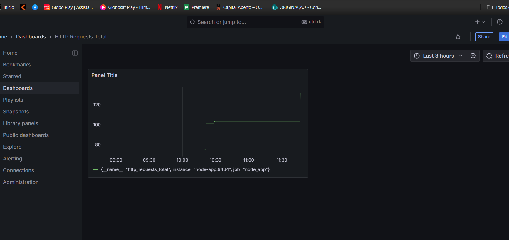

# Coleta de Métricas com Prometheus, Grafana e OpenTelemetry

Este repositório contém o código e a documentação referentes ao estudo sobre coleta de métricas em aplicações web, integrando Prometheus e Grafana para observabilidade, inicialmente utilizando .NET e posteriormente migrando para Node.js e TypeScript devido a conflitos de versão.

## Visão Geral

O objetivo deste autodesenvolvimento é:

- Implementar a coleta de métricas em uma aplicação web.
- Utilizar OpenTelemetry para expor métricas em um formato compreensível pelo Prometheus.
- Configurar o Prometheus para coletar essas métricas.
- Integrar o Grafana para visualização das métricas coletadas em forma de gráficos e dashboards.

Inicialmente, foi seguido o tutorial da Microsoft para .NET:
[Coleta de Métricas no .NET](https://learn.microsoft.com/pt-br/aspnet/core/log-mon/metrics/metrics?view=aspnetcore-8.0)

Entretanto, devido a problemas de versionamento e conflitos entre pacotes, decidiu-se adotar uma abordagem alternativa utilizando Node.js e TypeScript para a parte final da tarefa, mantendo a mesma proposta de coleta e visualização de métricas.

---

## Parte 1: Implementação Inicial em .NET

### Passo a Passo (Conforme Tutorial Microsoft):

1. Criação da aplicação web em .NET:
   ```bash
   dotnet new web -o WebMetric
   cd WebMetric
   dotnet add package OpenTelemetry.Exporter.Prometheus.AspNetCore --prerelease
   dotnet add package OpenTelemetry.Extensions.Hosting
   ```

   

2. Instalação da ferramenta de monitoramento:
   ```bash
   dotnet tool update -g dotnet-counters
   ```
   
   

3. Execução da aplicação:
   ```bash
   dotnet run
   ```
   
   

4. Monitoramento de contadores utilizando `dotnet-counters`:
   ```bash
   dotnet-counters monitor -n WebMetric --counters Microsoft.AspNetCore.Hosting
   ```
   
   

5. Métrica coletada: `http.server.request.duration`  
   

6. Monitorando um contador customizado:
   ```bash
   dotnet-counters monitor -n WebMetric --counters Contoso.Web
   ```
   
   

Neste ponto, a ideia era seguir o tutorial da Microsoft para integrar Prometheus e Grafana. Entretanto, ocorreram problemas de versão que dificultaram a conclusão do passo "Preencher métricas no Grafana com OpenTelemetry e Prometheus".

---

## Parte 2: Migração para Node.js, TypeScript, OpenTelemetry e Prometheus

Para contornar os problemas de versão no .NET, optou-se por implementar a mesma lógica de coleta de métricas utilizando Node.js e TypeScript, conforme passos a seguir:

### Passo a Passo Node.js + TypeScript + OpenTelemetry + Prometheus + Grafana

1. Criação do app Node.js:
   ```bash
   mkdir my-telemetry-app
   cd my-telemetry-app
   yarn init -y
   ```

2. Instalação das dependências:
   ```bash
   yarn add express
   yarn add -D typescript ts-node @types/node @types/express
   yarn add @opentelemetry/api @opentelemetry/sdk-node @opentelemetry/sdk-metrics @opentelemetry/exporter-prometheus
   ```

3. Configuração do TypeScript:
   ```bash
   npx tsc --init
   ```
   
   Ajuste o `tsconfig.json` conforme necessário (por exemplo, `esModuleInterop`: true, `strict`: true).

4. Criação dos arquivos e configuração do Docker, Prometheus e Grafana.  
   Após criar e configurar `Dockerfile`, `docker-compose.yml`, `prometheus.yml` e o código fonte da aplicação (conforme tutorial acima), rode:
   ```bash
   docker-compose up --build
   ```

   

5. Acesso ao Grafana:
   - URL: `http://localhost:3000`
   - Login padrão: admin / admin

   

6. Configuração do Prometheus como fonte de dados no Grafana:
   - No Grafana, vá em "Configuration" > "Data Sources"
   - Adicione uma nova fonte de dados Prometheus: `http://prometheus:9090`

   

7. Criação de um Dashboard no Grafana:
   - "Create" > "Dashboard"
   - Adicione um painel (panel) e consulte a métrica `http_requests_total` (exposta pela aplicação Node.js).

   

8. Evidências do Prometheus:
   - Acesse `http://localhost:9090` para ver o Prometheus rodando e consultando as métricas.
   
   

9. Endpoint de métricas do Exporter Prometheus (Node.js):
   - Acesse `http://localhost:9464/metrics` para verificar as métricas expostas.
   
   

10. Visualização do Dashboard no Grafana com as métricas da aplicação Node.js:
    
    

---

## Conclusão

A primeira tentativa utilizando .NET seguiu parcialmente o tutorial oficial da Microsoft. Entretanto, devido a conflitos de versão, a conclusão do passo "Preencher métricas no Grafana com OpenTelemetry e Prometheus" não foi possível no ambiente .NET original.

Para contornar essa limitação, foi implementada uma solução equivalente utilizando Node.js e TypeScript, mantendo os mesmos conceitos de instrumentação, exposição de métricas e visualização via Prometheus e Grafana. O resultado final é um ambiente funcional, Dockerizado, que pode ser facilmente reproduzido utilizando os comandos apresentados.

---

## Reproduzindo o Ambiente

1. Clone este repositório:
   ```bash
   git clone <url-do-repo>
   cd <pasta-do-repo>
   ```

2. Suba os serviços com Docker Compose:
   ```bash
   docker-compose up --build
   ```

3. Acesse a aplicação:
   - Aplicação Node.js: http://localhost:8080
   - Métricas: http://localhost:9464/metrics
   - Prometheus: http://localhost:9090
   - Grafana: http://localhost:3000 (usuário: admin, senha: admin)

4. Crie ou ajuste dashboards no Grafana para visualizar as métricas coletadas.

---

## Seção de Prints e Demonstrações

- [Imagem 1 - Criação do projeto .NET](image.png)
- [Imagem 2 - dotnet-counters](image-1.png)
- [Imagem 3 - Aplicação em execução no .NET](image-2.png)
- [Imagem 4 - Monitorando contadores no .NET](image-3.png)
- [Imagem 5 - Métrica http.server.request.duration](image-4.png)
- [Imagem 6 - Contadores customizados no .NET](image-5.png)
- [Imagem 7 - Execução ambiente Node.js com Docker Compose](image-7.png)
- [Imagem 8 - Configuração do Grafana](image-6.png)
- [Imagem 9 - Prometheus como Data Source no Grafana](image-8.png)
- [Imagem 10 - Criação de Dashboard no Grafana](image-9.png)
- [Imagem 11 - Prometheus em execução](image-10.png)
- [Imagem 12 - Endpoint /metrics da aplicação Node.js](image-11.png)
- [Imagem 13 - Dashboard Grafana com métricas do Node.js](image-12.png)

---

Esta documentação foi elaborada de forma clara e passo a passo, permitindo a reprodução do ambiente e a visualização das métricas, além de esclarecer o motivo da mudança de tecnologia do .NET para o Node.js.